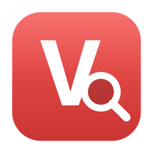

# Vivaldi Profile Launcher

A tiny macOS app to **search your Vivaldi profiles by name and open them** — and
to **spin up new profiles instantly** by cloning a ready-made template (with your
bookmarks and Speed Dial already set up).

- Type a profile name → it opens.
- If that profile is already open → its window is brought to the front (no duplicate).
- If it doesn't exist → it's created from your `Default-template` profile.

No dependencies beyond what macOS already ships with.

<p align="center"></p>

---

## Install

Paste this into Terminal:

```bash
curl -fsSL https://raw.githubusercontent.com/Ziggiz/vivaldi-profile-launcher/main/install.sh | bash
```

That's it — the app is built on your machine (so macOS won't flag it as an
untrusted download) and installed to **/Applications**. Launch it from Spotlight
(`⌘-Space` → “Vivaldi Profiles”).

> Need Apple's command-line tools? If the installer says `python3` is missing,
> run `xcode-select --install` once and try again.

<details>
<summary>Prefer to clone and build manually?</summary>

```bash
git clone https://github.com/Ziggiz/vivaldi-profile-launcher.git
cd vivaldi-profile-launcher
./install.sh
```
</details>

---

## Use

Open **Vivaldi Profiles**:

1. Start typing to jump to a profile in the list.
2. Pick a profile → it opens (or its existing window is focused).
3. Pick **➕ Create new profile …** → type a name → it's cloned from your template
   and opened.

### Creating profiles from a template

To use the “create new profile” feature, first make one Vivaldi profile named
**`Default-template`** and set it up the way you want new profiles to start
(bookmarks, Speed Dial, settings). New profiles are cloned from it — but each
clone starts fresh: history, cookies, logins and sessions are **not** copied over.

You can search and open existing profiles without a template; it's only needed
for creating new ones.

---

## How it works

Two small layers, so the UI can be replaced without touching the logic:

- **`vivaldi_profiles.py`** — a Python 3 CLI (standard library only) that reads
  Vivaldi's `Local State`, launches profiles, and clones the template.
- **`launcher.applescript`** — a native AppleScript front-end, compiled into
  `Vivaldi Profiles.app`. The CLI is bundled inside the app, so it's fully
  self-contained.

### Command line

You can also drive it directly:

```bash
python3 vivaldi_profiles.py list                 # all profile names
python3 vivaldi_profiles.py open "Some Profile"  # open / focus a profile
python3 vivaldi_profiles.py create "New One"     # clone template -> new profile
python3 vivaldi_profiles.py create "New One" --dry-run   # preview, write nothing
```

Configuration is optional — copy `config.example.json` to `config.json` to change
the template name, the Vivaldi path, or which files get wiped from a clone.

---

## Notes

- Tested on Apple Silicon. Creating a profile writes to Vivaldi's `Local State`,
  so the tool closes Vivaldi first (after asking) and always makes a
  `Local State.bak` backup before writing.
- Run the tests with: `python3 -m unittest discover -s tests`

## License

[MIT](LICENSE)
